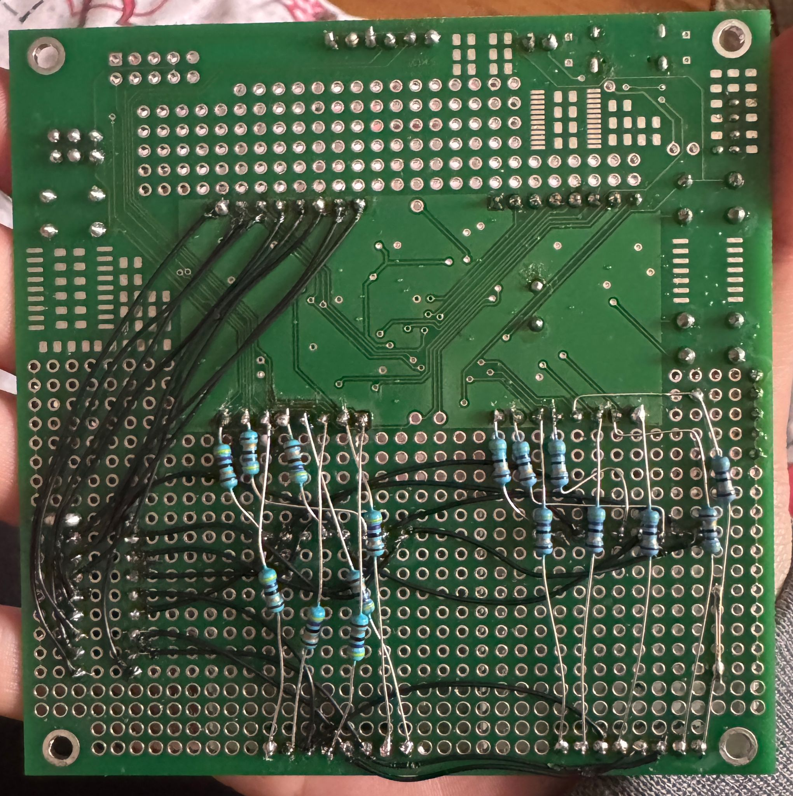
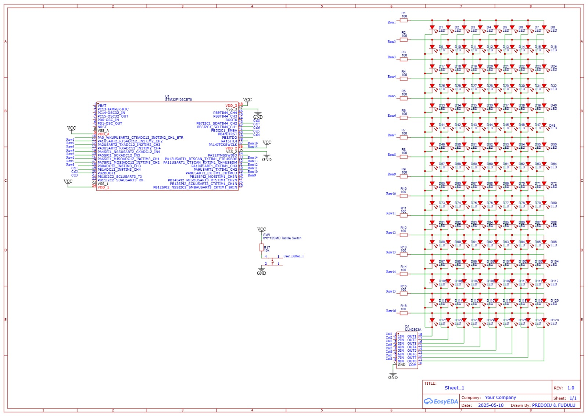
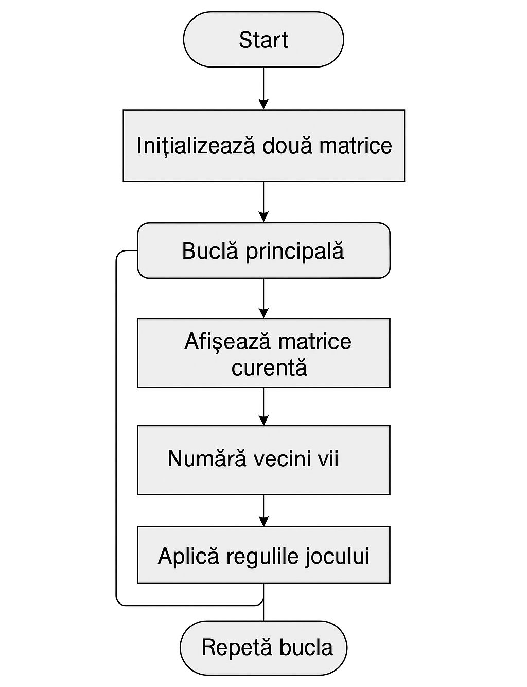

# STM32 Game of Life

## Overview

This project presents an embedded implementation of **Conway's Game of Life** using an **STM32F103CBT6 microcontroller** and two multiplexed **8×8 LED matrices**, resulting in a 16×8 display.

The application was developed in **C** using **Visual Studio Code** and combines embedded software development with custom hardware design. The project includes the implementation of the Game of Life algorithm, software-based LED matrix multiplexing, UART communication for debugging, GPIO control, timer-based refresh, and a hardware interface built around the **ULN2803A Darlington driver**.

The simulation updates the state of each cell according to Conway's original rules and displays every new generation in real time on the LED matrix. A dedicated push button allows the simulation to restart from the initial configuration without reprogramming the microcontroller.

In addition to the software implementation, the hardware architecture was designed and validated, including the electrical schematic, LED matrix control, current-driving stage and peripheral configuration required for reliable real-time operation.

This project demonstrates the integration of embedded programming, digital electronics and real-time control into a complete hardware-software system.

---

## Features

- Conway's Game of Life implementation
- STM32F103CBT6 embedded application
- Software multiplexing for dual 8×8 LED matrices
- Real-time LED matrix visualization
- UART communication for debugging
- GPIO and timer peripheral configuration
- Push-button reset functionality
- Hardware design using ULN2803A drivers
- Electrical schematic created in EasyEDA

---

## Hardware

- STM32F103CBT6 Microcontroller
- Two 8×8 LED Matrices
- ULN2803A Darlington Driver
- Push Button
- Custom Hardware Schematic

---

## Software

- Programming Language: C
- Development Environment: Visual Studio Code
- UART Communication
- GPIO Control
- Timer-Based Multiplexing
- Conway's Game of Life Algorithm

---

## Project Images

### Hardware 



### PCB / Electric Scheme



### Organigram



---

## Repository Structure

```text
STM32-Game-of-Life

├── code/
│   ├── main.c
│   
│
├── images/
│
│
└── README.md
```

---

## Technologies

- C
- STM32
- Visual Studio Code
- UART
- GPIO
- Timers
- EasyEDA
- Embedded Systems

---

## Author

**Violeta Fudulu**
